# CKA - 3rd session problem

**Problem:** Setup deployment, service and ingress for a php and nginx application which prints a different pod name in every page refresh.

**Instructor:** Morteza Ghasempoor

**Writer:** Mohammad Soroushzadeh

**Email:** m44.soroush@gmail.com

**Date:** Sun May 30, 2021

## 1: Setup k8s cluster

A cluster with 1 master and 2 worker nodes with kubeadm have been initialized:

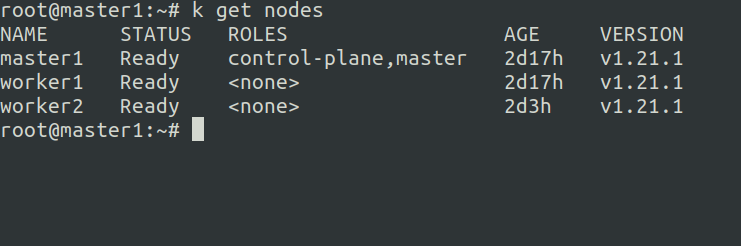

---

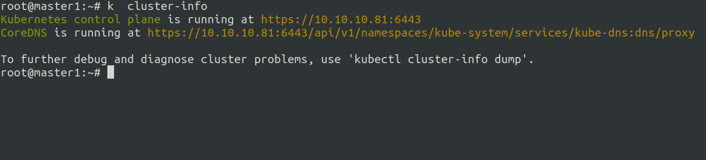

## 2:  Deploy php-fpm and nginx app

I wrote a simple php script to print pod name and pod IP:

```php
<?php
echo "<pre>";
echo "Time: " . date("H:i:s") . "\n";
echo "Pod name: " . gethostname() . "\n";
echo "Pod ip: " . $_SERVER['SERVER_ADDR'] . "\n";
echo "</pre>";
?>
```

And made nginx config to be able to connect to php-fpm container in order to render php scripts:

```nginx
server {
    listen 8080;
    index index.php index.html;
    error_log  /var/log/nginx/error.log;
    access_log /var/log/nginx/access.log;
    root /app;

    location ~ \.php$ {

        expires -1;

        try_files $uri =404;
        fastcgi_split_path_info ^(.+\.php)(/.+)$;
        fastcgi_pass 127.0.0.1:9000;
        fastcgi_index index.php;
        include fastcgi_params;
        fastcgi_param SCRIPT_FILENAME $document_root$fastcgi_script_name;
        fastcgi_param PATH_INFO $fastcgi_path_info;
    }
}
```

**Note:** Since fpm and nginx containers are in 1 pod, they have a same sandbox and nginx can connect to fpm using localhost (`127.0.0.1`) IP address.

**Note:** I used `expires -1` option to disable cache while refreshing in browser. 

**Note:** Script file is in `/app` and will be mounted to both containers.

Next, I tried to write a deployment for my app:

```yaml
apiVersion: apps/v1
kind: Deployment
metadata:
  name: anisa
  labels:
    app: my-fpm
spec:
  replicas: 4
  selector:
    matchLabels:
      app: my-fpm
  temlate:
    metadata:
      labels:
        app: my-fpm
    spec:
      containers:
        - name: nginx
          image: dockerhub.ir/nginx:alpine
          ports:
            - containerPort: 8080
          volumeMounts:
            - name: nginx-conf
              mountPath: /etc/nginx/conf.d
            - name: app-code
              mountPath: /app
        - name: php
          image: dockerhub.ir/php:fpm-alpine
          volumeMounts:
            - name: app-code
              mountPath: /app
      volumes:
        - name: app-code
          hostPath:
            path: /root/php-app/app
        - name: nginx-conf
          hostPath:
            path: /root/php-app/conf
```

### Explanation

There are two containers in one pod, php-fpm will just listen locally on port `9000` and nginx container listens on port `8080`. Two volumes were defined, one for php script and one for nginx config, and these volumes were mounted to containers.

**Note:** Since I used `hostPath` volume type, I should create `/root/php-app` directory for all of the worker nodes to be able to access the nginx config and php script, but this is not a good solution, so I tried to use `ConfigMap`.

### Using ConfigMap

I created two configmaps for nginx config and php script:

```yaml
apiVersion: v1
kind: ConfigMap
metadata:
  name: nginx-fpm-config
data:
  site.conf: |
    server {
      listen 8080;
      index index.php index.html;
      error_log  /var/log/nginx/error.log;
      access_log /var/log/nginx/access.log;
      root /app;
      location ~ \.php$ {
        expires -1;
        try_files $uri =404;
        fastcgi_split_path_info ^(.+\.php)(/.+)$;
        fastcgi_pass 127.0.0.1:9000;
        fastcgi_index index.php;
        include fastcgi_params;
        fastcgi_param SCRIPT_FILENAME $document_root$fastcgi_script_name;
        fastcgi_param PATH_INFO $fastcgi_path_info;
      }
    }
```

```yml
apiVersion: v1
kind: ConfigMap
metadata:
  name: php-script
data:
  index.php: |
    <?php
    echo "<pre>";
    echo "Time: " . date("H:i:s") . "\n";
    echo "Pod name: " . gethostname() . "\n";
    echo "Pod ip: " . $_SERVER['SERVER_ADDR'] . "\n";
    echo "</pre>";
    ?>
```

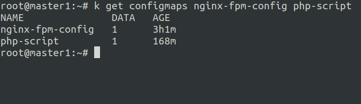

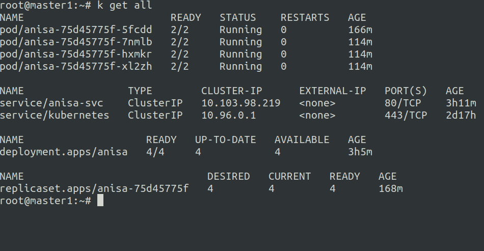

## 3: Create a clusterIP service

I wrote a manifest for my service:

```yaml
apiVersion: v1
kind: Service
metadata:
  name: anisa-svc
spec:
  selector:
    app: my-fpm
  ports:
    - port: 80
      targetPort: 8080
      protocol: TCP
      name: http
```

**Note:** As you know, the default type is clusterIP, so I didn't define it.

**Note:** App selector for this service is `app=my-fpm` label, and all pods should have this label.

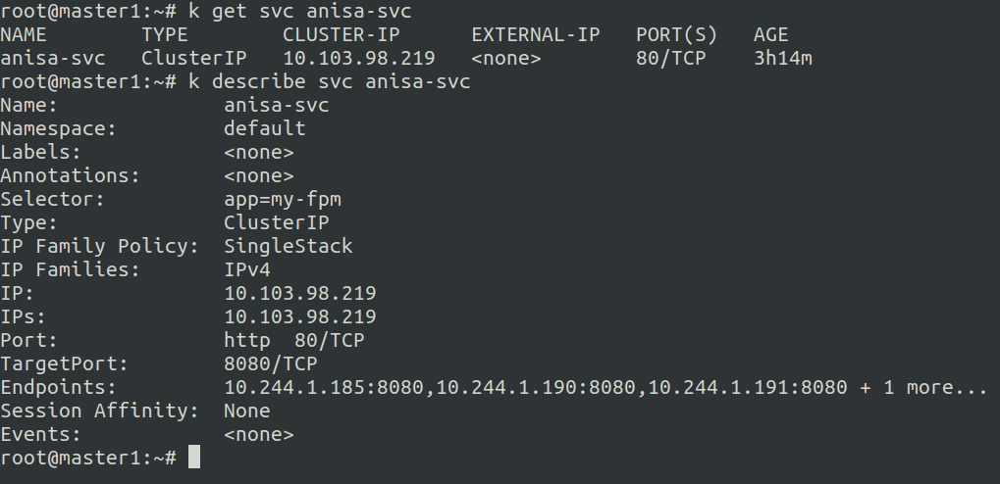

## 4: Scale deployment up & down

Scale up & down commands:

```bash
$ k scale deployment --replicas=10 anisa
$ k scale deployment --replicas=5 anisa
```

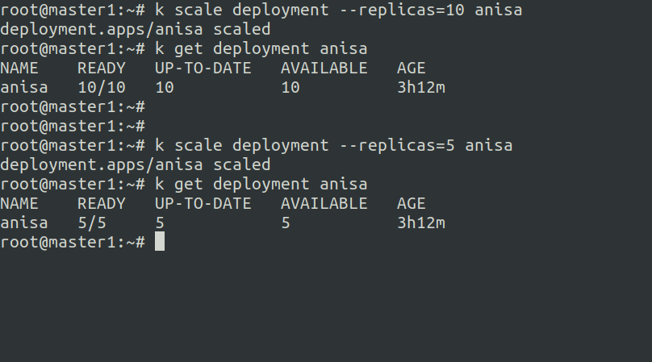

## 5: Ingress [cka.anisa.co.ir]()

To have ingress resource in kubernetes cluster we should first have ingress controller.

### Ingress controller

There are many ingress controllers such as Nginx, HAproxy, Traefik, Kong and so on, you can see the full list in [Ingress Controllers | Kubernetes](https://kubernetes.io/docs/concepts/services-networking/ingress-controllers/) link.

My prefer was Nginx ingress controller, but we should notice that there are two nginx ingress controllers, one of them is developed by google called `ingress-nginx` and the other one is provided by Nginx and named `nginx-ingress` which is better.

In order to install `nginx-ingress` controller I used this [NGINX Docs | Installation with Manifests](https://docs.nginx.com/nginx-ingress-controller/installation/installation-with-manifests/) instruction.

There were two ways for installing it:

- Using helm chart

- Using manifests

I preferred manifest way to understand what's going on. 

#### Nginx ingress controller installation steps:

1. Clone the [main repo](https://github.com/nginxinc/kubernetes-ingress/) and checkout to stable version.

2. Configure RBAC:
   
   - Namespace and a service account for the Ingress controller
   
   - Cluster role and cluster role binding for the service account

3. Create Common Resources:
   
   - Secret with TLS certificate for default nginx pages like 404
   
   - ConfigMap for  customizing nginx configuration
   
   - IngressClass resource for Kubernetes >= 1.18 (My cluster version: 1.21)

4. Create Custom Resources (CRD): 
   
   - Resource definitions for VirtualServer and VirtualServerRoute, TransportServer and Policy resources
   
   - GlobalConfiguration resource

5. Deploy the Ingress Controller (2 ways):
   
   - Via Daemonset:
     
     Port 80 and 443 of the Ingress controller container are mapped to the same ports of the node where the container is running.
   
   - Via Deployment and nodeport service:
     
     Will randomly set two ports on every node of the cluster. To access the Ingress controller, we can use an IP address of any node of the cluster along with that two ports.

#### Output:

- Via Deployment and Service:

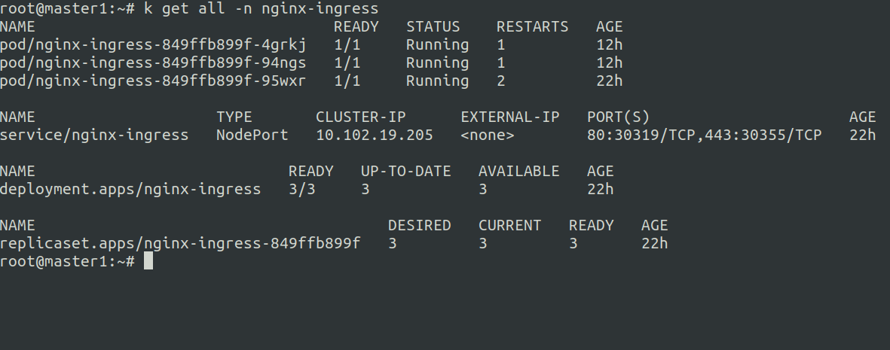

- Via Daemonset:
  
      on every worker nodes one pod is listening for tcp 80 and 443.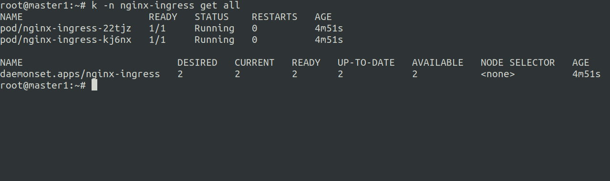

### Ingress Resource for [cka.anisa.co.ir]()

I created an ingress resource for my app:

```yaml
apiVersion: networking.k8s.io/v1
kind: Ingress
metadata:
  name: fpm-ingress
spec:
  ingressClassName: nginx
  rules:
    - host: cka.anisa.co.ir
      http:
        paths:
          - path: /
            pathType: Prefix
            backend:
              service:
                name: anisa-svc
                port:
                  number: 80
```

**Note:** I used v1 version for Ingress resource, and in this api version we should define `ingressClassName` when the kubernetes version is >= `v1.18`. Some options are different from v1beta version.

#### Output:

- Ingress resource
  
  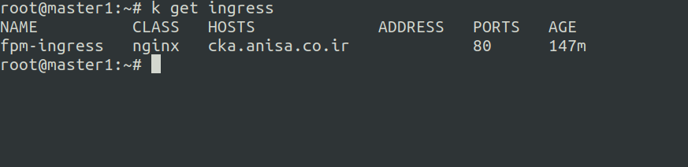

- Via Deployment and Service:
  
  I added `cka.anisa.co.ir` with master IP to `/etc/hosts`, but It's possible to point domain name to any of the master or worker nodes IP.
  
  As you see in every refresh the pod name and the pod IP is changing.
  
  Load balancing is working perfectly via ingress and service :)
  
  Port 30319:
  
  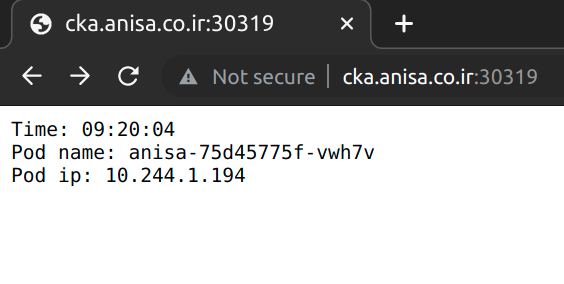
  
  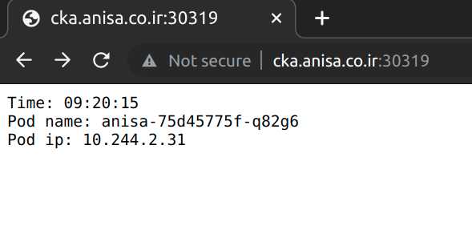
  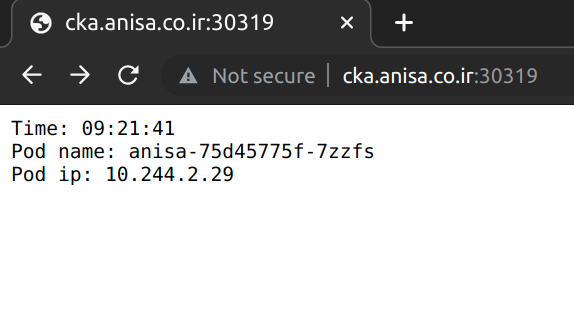

- Via Daemonset:
  
  In this situation I pointed the domain name to one of the workers IP in `/etc/hosts`, because there is no service running, and I should not point the domain name to master node IP.
  
  port 80:
  
  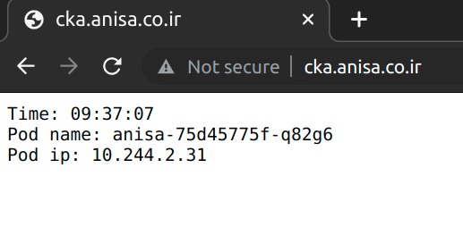
  
  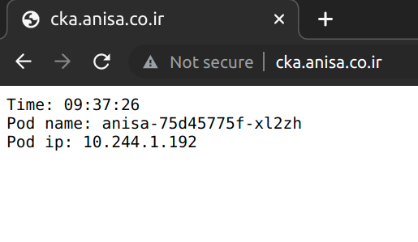

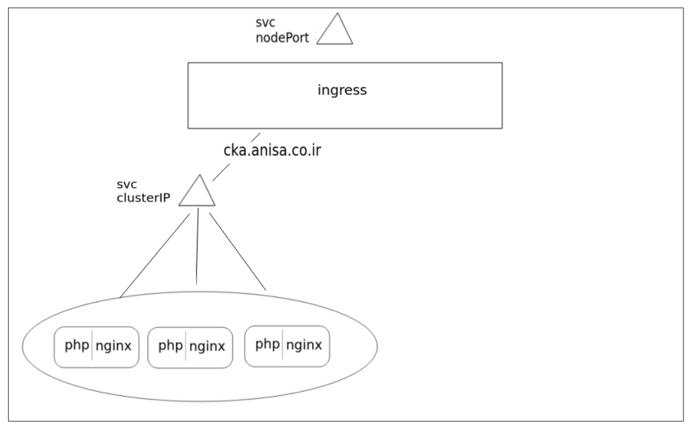
